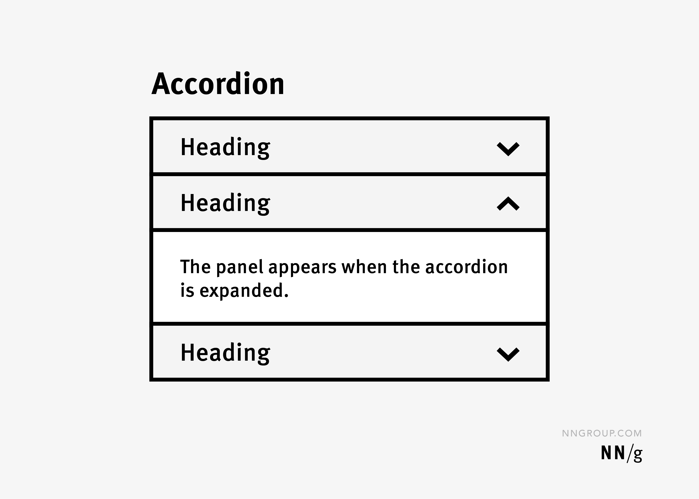

## Acordion

Accordion ist ein Interaktives UI-Element. Mit dem man Inhalte platzsparend strukturieren kann. Es zeigt mehrere Panels die auf oder zu geklappt werden können. So können gezielte Informationen angezeigt werden, ohne durch lange Text mengen zu scrollen müssen. Typische Einsatzbereiche sind FAQ Seiten, Produktdetails oder Hilfetexte. Accordeons verbessern die Übersichtlichkeit, fördern fokussiertes lesen und sind besonders nützlich auf Mobilengeräten, da sie Bildschirmplatz sparen.

### Alternativbegriffe:

* Aufklappbereich
* Expand/Collapse Panel
* Klappmenü

### Beispiel Bilder

## Carousel

Ein Carousel ist eine Web-Komponente, mit der mehrere Bilder, Texte oder andere Inhalte platzsparend in einem Bereich dargestellt werden. Die einzelnen Inhalte werden nacheinander angezeigt und können meist über Pfeile, Punkte oder durch Wischen gewechselt werden. Carousels werden häufig auf Startseiten, in Bildergalerien oder zur Präsentation von Produkten und Angeboten eingesetzt.

### Alternativbegriffe:

* Bilderkarussell
* Slider
* Content Slider

### Beispiel Bilder

